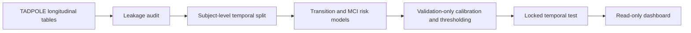

# AD-TabFusion

**Research question:** Can longitudinal multimodal clinical tables predict future CN/MCI/AD state and MCI-to-AD progression while preserving strict temporal validation, calibration, and uncertainty reporting?


## Core Results

| Evidence | Split | Metric | Frozen result |
|---|---|---:|---:|
| Transition-aware diagnosis model | Locked temporal test | Macro F1 | **0.881** |
| Transition-aware diagnosis model | Locked temporal test | ROC-AUC OvR | **0.958** |
| Source diagnosis + forecast horizon ablation | Validation | Macro F1 | **0.820** |
| MCI progression, 24 months | Locked temporal test, n=53 | ROC-AUC | **0.797** |
| MCI progression, 36 months | Locked temporal test, n=44 | ROC-AUC | **0.804** |
| Isotonic calibration | Locked temporal test | Log Loss | **0.352** |
| Selective prediction, 80% target | Locked temporal test | Coverage / Macro F1 | **81.1% / 0.926** |

## Method



## Scientific Rigor

- Subject-level isolation prevents the same participant from crossing data splits.
- Future diagnoses and post-index outcomes are excluded from predictors.
- Model, calibrator, and confidence-threshold choices are made on validation data only.
- The dashboard reads frozen CSV/JSON artifacts and never trains, fits, calibrates, or overwrites results.
- D4 is always labeled **exploratory post-hoc replay, not independent confirmatory validation**.

## Run Locally

```bash
pip install -r requirements.txt
streamlit run dashboard/app.py
```

The dashboard supports Chinese and English from the sidebar.

## Data Compliance

Source ADNI/TADPOLE data are not redistributed. Public screenshots and dashboard pages contain aggregate metrics only; RID, PTID, and participant-level rows are not displayed. Users must obtain source data through the applicable ADNI/TADPOLE access and data-use process.

## Limitations

- This is retrospective research software, not a clinical decision system.
- The 48-month MCI result is small-sample exploratory evidence (n=22).
- PET, CSF, and DTI are sparse and are not complete active modalities in the primary model.
- D4 replay is post-hoc and cannot establish independent external confirmation.

## Detailed Reports

- [Phase A: data and leakage audit](outputs/phase_a/audit_report.md)
- [Phase B: compact vs full internal study](outputs/phase_b/compact_vs_full_report.md)
- [Phase C: D3/D4 matching report](outputs/phase_c/evaluation/d3_d4_matching_report.md)
- [Phase D: final frozen report](outputs/reports/phase_d_final_report.md)
- [Dashboard redesign report](docs/dashboard_redesign_report.md)

Presentation materials: [中文项目简介](docs/project_brief_zh.md) · [English project brief](docs/project_brief_en.md) · [中文演示脚本](docs/demo_script_zh.md) · [result cards](docs/result_cards.md)
